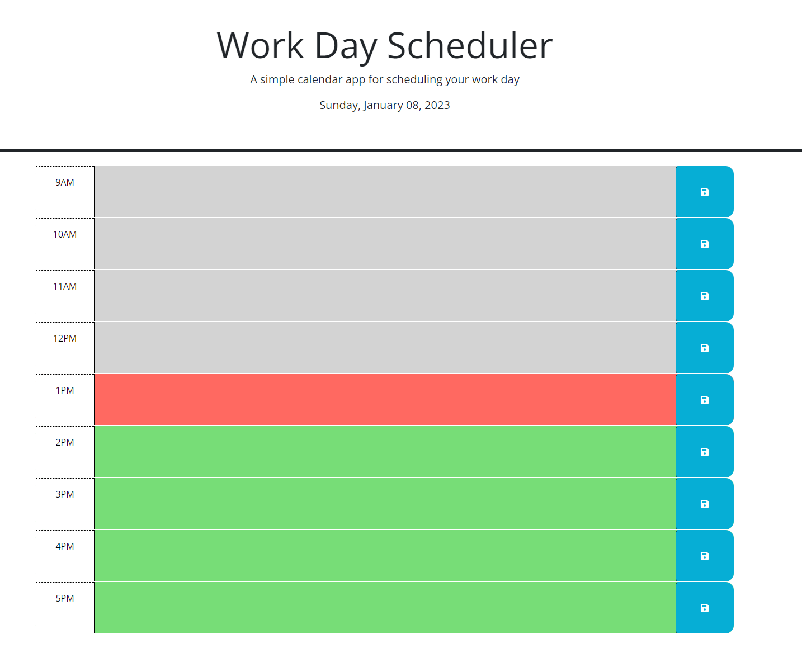

# Work Day Planner

## Description

The purpose of this project was to create a small calendar app to track events during business hours. This solves the problem of not having the events stored in an easy to access place. This helped solidify jQuery and DayJS for me.

## Installation

There is no installation required for this. Simply visit the link of the deployed page [here](https://blaubachs.github.io/work-day-planner/).

## Usage

To use this app, simply enter in your event in the field of the corrosponding time that you would like to save. Then, press the blue save button to the right, and it will be saved to local storage. The save button will save all of your events, no matter which one you click on.

## License

No license.

## Features

Each actitivity that is entered into the page and saved will be saved to local storage if saved by the user.
    - On page load, it will render each of the activities saved from local storage.
Each text area has color corrospondance based on if the hour on the page is in the past, present, or future.
    - Gray is in the past.
    - Red is in the present.
    - Green is in the future.
    - These dynamically update on the page based on the time.
The current date is listed in the header of the page.
